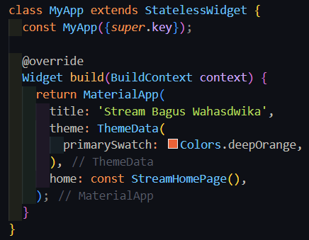
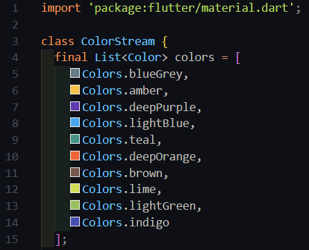
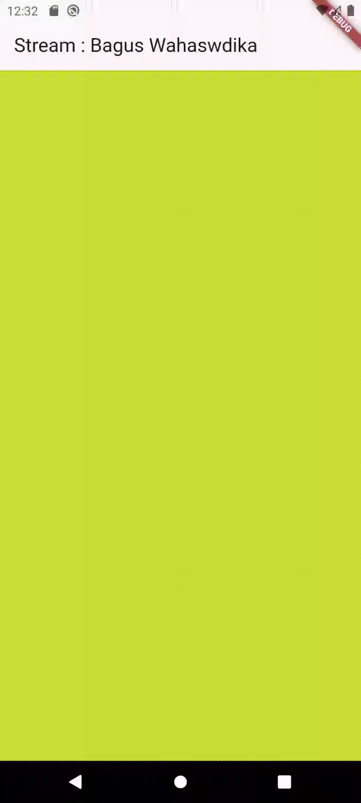
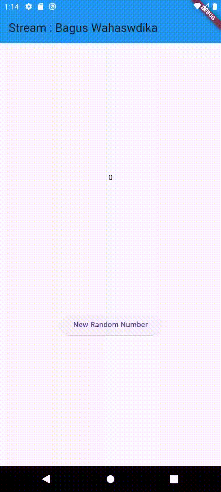
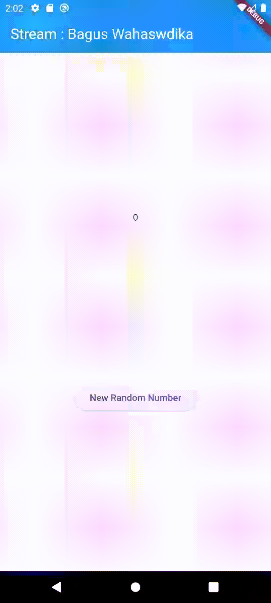
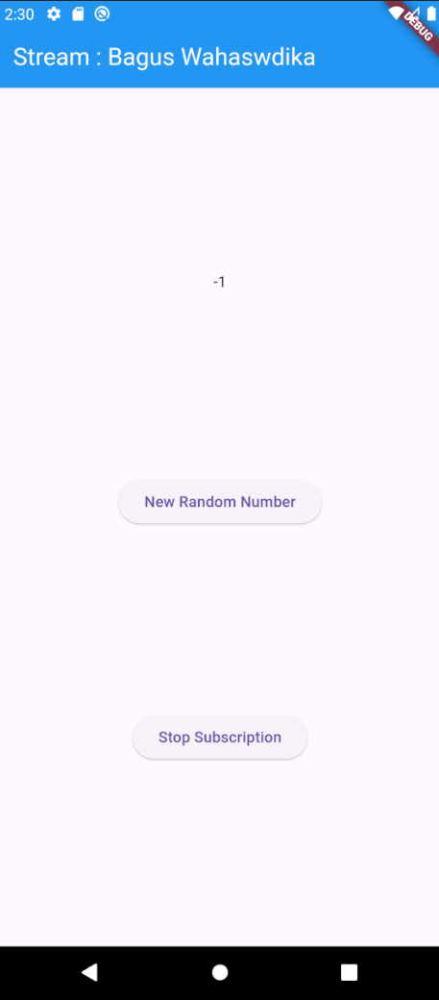
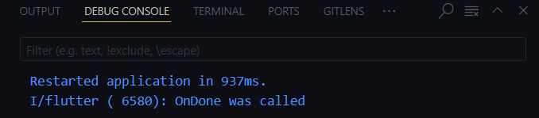
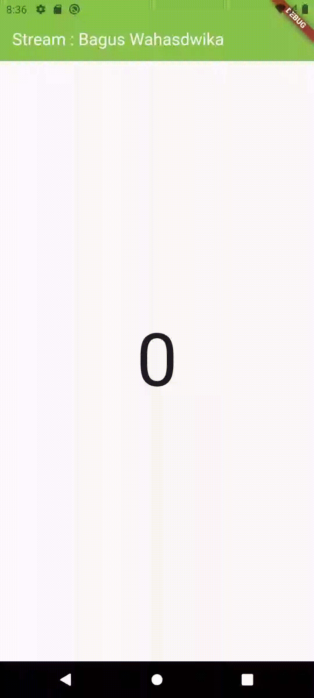

# **State Management dengan Streams**

## Nama : Sukma Bagus Wahasdwika

## NIM  : 2241720223

## **Praktikum 1 - Dart Streams**

### **Soal 1:**
* Tambahkan nama panggilan Anda pada title app sebagai identitas hasil pekerjaan Anda.
* Gantilah warna tema aplikasi sesuai kesukaan Anda.

    

### **Soal 2:**
* Tambahkan 5 warna lainnya sesuai keinginan Anda pada variabel colors tersebut.

    

### **Soal 3:**
* Jelaskan fungsi keyword yield* pada kode tersebut!
    **Jawab:** 
    
    keyword yield* digunakan untuk menghasilkan (yield) seluruh elemen dari stream lain secara langsung. Dalam konteks ini: yield* Stream.periodic(...) berarti semua elemen yang dihasilkan oleh Stream.periodic akan diteruskan (forwarded) ke stream yang dihasilkan oleh fungsi getColors().

* Apa maksud isi perintah kode tersebut?
    **Jawab:**

    - Fungsi getColors() akan mengalirkan warna secara berulang setiap 1 detik.
    - Warna yang dihasilkan mengikuti urutan dari daftar colors.
    - Jika sudah mencapai warna terakhir, stream akan kembali ke awal daftar (karena menggunakan modulus %).

### **Soal 4:**
* Capture hasil praktikum Anda berupa GIF dan lampirkan di README.

    

### **Soal 5:**
* Jelaskan perbedaan menggunakan listen dan await for (langkah 9) !

    **Jawab:**

    | **Fitur**                 | **`await for`**               | **`listen`**                  |
    |---------------------------|-------------------------------|-------------------------------|
    | **Fleksibilitas**         | Terbatas                      | Tinggi(Bisa Menghentikan)     |
    | **Sifat**                 | Sequential dan sederhana      | Memberikan kontrol penuh      |
    | **Penanganan Error**      | Tidak tersedia                | Dapat menggunakan "onError"   |
    | **Penanganan Selesai**    | Implicit (otomatis berhenti)  | Dapat menggunakan "onDone"    |

## **Praktikum 2 - Stream controllers dan sinks**

### **Soal 6:**
* Jelaskan maksud kode langkah 8 dan 10 tersebut!
    **Jawab:**

    - initState: Membuat stream dan memasang listener untuk mendeteksi angka baru yang dipancarkan.
    Proses yang dilakukan yaitu :
    Pada metode initState, sebuah stream dibuat dan listener dipasang untuk mendengarkan angka-angka yang dipancarkan oleh stream.
    Setiap kali stream memancarkan angka baru, listener akan menangkapnya dan memperbarui nilai variabel lastNumber dengan angka terbaru. Jika aplikasi menggunakan setState, UI akan diperbarui untuk mencerminkan perubahan tersebut.
    - addRandomNumber: Menghasilkan angka baru secara acak, menambahkannya ke stream, dan membiarkan listener menangani pembaruan UI.
    Proses yang dilakukan yaitu :
    Sebuah angka acak dibuat menggunakan fungsi pembangkit angka acak (misalnya Random()).
    Angka ini kemudian ditambahkan ke stream menggunakan mekanisme pengiriman data (seperti add pada StreamController).
    Listener yang sebelumnya dipasang di initState menerima angka baru ini, memperbarui variabel lastNumber, dan memicu pembaruan UI.

* Capture hasil praktikum Anda berupa GIF dan lampirkan di README.

    

### **Soal 7:**
* Jelaskan maksud kode langkah 13 sampai 15 tersebut!
    **Jawab:**

    - addError memungkinkan kita untuk mengirimkan error ke dalam stream, seperti halnya mengirimkan data biasa.
    - onError membantu aplikasi mendeteksi dan menangani error, sehingga dapat mengambil tindakan yang sesuai, seperti memperbarui UI atau memberikan pesan kesalahan kepada pengguna.
    - addRandomNumber Fungsi ini dimodifikasi untuk mengirimkan error alih-alih angka acak, sehingga memvalidasi apakah aplikasi dapat menangani situasi error dengan benar.

* Kembalikan kode seperti semula pada Langkah 15, comment addError() agar Anda dapat melanjutkan ke praktikum 3 berikutnya.!

## **Praktikum 3 - Injeksi data ke streams**

### **Soal 8:**
* Jelaskan maksud kode langkah 1-3 tersebut!
    **Jawab:**
    
    - stream.transform(transformer): Menerapkan sebuah StreamTransformer untuk mengubah data dalam stream sebelum data tersebut diterima oleh pendengar (listener). Transformer ini memungkinkan modifikasi, filter, atau manipulasi data pada aliran sebelum data tersebut diproses lebih lanjut.
    - listen((event) { ... }): Mendaftarkan pendengar ke stream untuk menerima setiap event (data) yang telah dimodifikasi oleh transformer. Dalam pendengar ini, Anda dapat menentukan bagaimana event akan diproses atau ditangani.
    - setState: Digunakan untuk memperbarui state dari widget, misalnya mengubah nilai variabel lastNumber dengan data terbaru yang diterima dari stream (event). Ini memastikan UI widget diperbarui sesuai perubahan data.
    - onError((error) { ... }): Menangani error yang terjadi di stream. Jika terjadi error, Anda dapat menentukan tindakan yang diambil, seperti mengubah state lastNumber menjadi -1 sebagai indikator kesalahan.

* Capture hasil praktikum Anda berupa GIF dan lampirkan di README.

    

## **Praktikum 4 - Subscribe ke stream events**

### **Soal 9:**
* Jelaskan maksud kode langkah 2, 6 dan 8 tersebut!
    **Jawab:**

    - StreamController digunakan untuk mengelola aliran data, biasanya dalam bentuk stream.
    - StreamSubscription bertanggung jawab untuk mendengarkan event dari stream. Dengan membatalkan subscription, Anda mencegah event yang tidak diperlukan diterima.
    - Menjaga controller agar tidak ditutup secara tidak sengaja memastikan aliran data tetap aktif selama diperlukan.

* Capture hasil praktikum Anda berupa GIF dan lampirkan di README.

    

    

## **Praktikum 5 - Multiple stream subscriptions**

### **Soal 10:**
* Jelaskan mengapa error itu bisa terjadi ?
    **Jawab:**

    Error ini terjadi karena mencoba (listen) pada stream yang sama lebih dari satu kali. Secara default, Stream pada Dart hanya mendukung satu listener aktif pada satu waktu (kecuali kita menggunakan broadcast stream).

### **Soal 11:**
* Jelaskan mengapa hal itu bisa terjadi ?
    **Jawab:**

    Hal ini terjadi karena mekanisme pembaruan values yang berasal dari dua atau lebih listener yang terhubung ke Stream yang sama. Setiap listener memancarkan perubahan secara independen, sehingga menyebabkan widget menerima banyak pembaruan dan menampilkan semua nilai tersebut. Untuk mengatasi ini, pastikan bahwa hanya satu listener yang mengelola pembaruan values, atau gunakan mekanisme pengelolaan state seperti StreamBuilder untuk memastikan pembaruan terjadi secara terkoordinasi.

* Capture hasil praktikum Anda berupa GIF dan lampirkan di README.

    

## **Praktikum 6 - StreamBuilder**

### **Soal 12:**
* Jelaskan maksud kode pada langkah 3 dan 7 ! 
    **Jawab:**

    *Langkah 3 :*
    - NumberStream adalah sebuah kelas yang menyediakan stream angka secara periodik.
    - getNumber() adalah metode yang menghasilkan (yield) stream angka dengan tipe int.
    - Stream.periodic digunakan untuk menghasilkan event secara periodik, yaitu setiap 1 detik (Duration(seconds: 1)).
    Di setiap event, Stream.periodic memanggil fungsi callback (int t), di mana:
    - Random random = Random(); membuat sebuah objek untuk menghasilkan angka acak.
    - random.nextInt(10) menghasilkan angka acak antara 0 sampai 9.
    - yield* digunakan untuk meneruskan semua nilai dari stream yang dihasilkan oleh Stream.periodic.
    Intinya: Metode ini akan mengirimkan angka acak setiap 1 detik melalui stream.

    *Langkah 7:*
    - stream: numberStream: StreamBuilder menerima numberStream (stream angka dari langkah 3).
    - initialData: 0: Data awal yang ditampilkan di layar sebelum stream mulai menghasilkan angka.
    - builder: (context, snapshot): Fungsi builder yang digunakan untuk membangun widget berdasarkan data terbaru (snapshot) dari stream.
    - if (snapshot.hasData) pertama: Kondisi ini menampilkan pesan Error! di konsol setiap kali ada data pada snapshot, tetapi tidak memiliki efek lain pada UI.
    if (snapshot.hasData) kedua:
    - Jika data tersedia, widget akan menampilkan teks angka terbaru dari stream.
    - snapshot.data berisi angka terbaru dari stream.
    - Text(snapshot.data.toString(), style: TextStyle(fontSize: 96)) menampilkan angka dalam ukuran font besar di tengah layar.
    - else:
    Jika tidak ada data, maka widget akan menampilkan SizedBox.shrink(), yaitu widget kosong.

* Capture hasil praktikum Anda berupa GIF dan lampirkan di README.

    

* Link Repo StreamBuilder: https://github.com/bagusswahasdwikaa/streambuilder_bagus

## **Praktikum 7 - BLoC Pattern**

### **Soal 13:**
* Jelaskan maksud praktikum ini ! Dimanakah letak konsep pola BLoC-nya ?
    **Jawab:**

    Praktikum ini bertujuan untuk memahami pola arsitektur BLoC dengan memisahkan logika bisnis dari antarmuka pengguna (UI). Aplikasi menghasilkan angka acak yang diperbarui secara otomatis di layar menggunakan stream saat tombol ditekan.

    *Letak Konsep BLoC*
    
    Pemisahan Logika dan UI:
    - Logika bisnis: Di random_bloc.dart, menghasilkan angka acak menggunakan stream.
    - UI: Di random_screen.dart, hanya mendengarkan data dari stream dan mengirim perintah melalui sink.
    
    Komunikasi melalui Stream dan Sink:
    - Stream (Output): Mengirim angka acak dari BLoC ke UI.
    - Sink (Input): Menerima event dari UI untuk memproses angka acak.
    
    - StreamBuilder:
    Menghubungkan UI dengan stream untuk memperbarui tampilan secara otomatis.

    - Pembuangan Data (Dispose):
    Stream Controller ditutup di dispose() agar tidak terjadi kebocoran memori.

    Pola ini menjamin aplikasi terstruktur, mudah di-maintain, dan efisien.

* Capture hasil praktikum Anda berupa GIF dan lampirkan di README.

    

* Link Repo BLoC Pattern: https://github.com/bagusswahasdwikaa/bloc_random_bagus